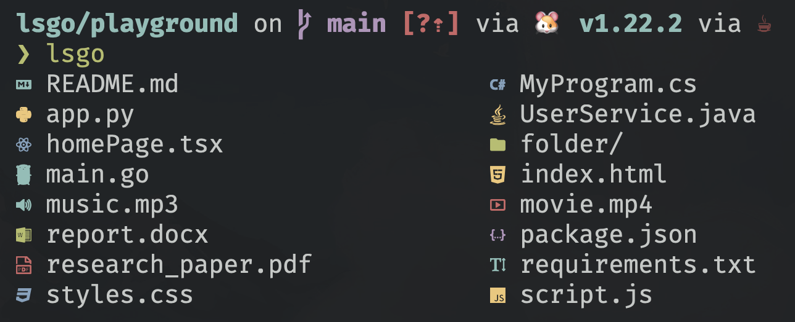

<h1 align='center'> lsgo - ls with icons, written in go </h1>



---

## Dependencies

1. Go language: [https://go.dev/doc/install](https://go.dev/doc/install)
2. Nerd fonts: [https://www.nerdfonts.com/font-downloads](https://www.nerdfonts.com/font-downloads) 

## Install as executable across operating system

```
git clone https://github.com/nivethan-me/lsgo.git
cd lsgo
go install lsgo
lsgo
```


